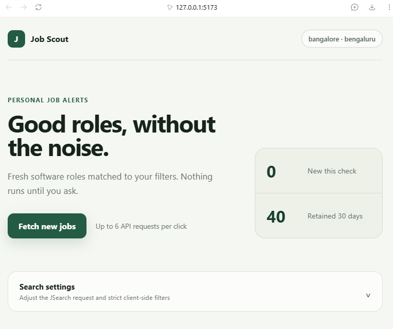
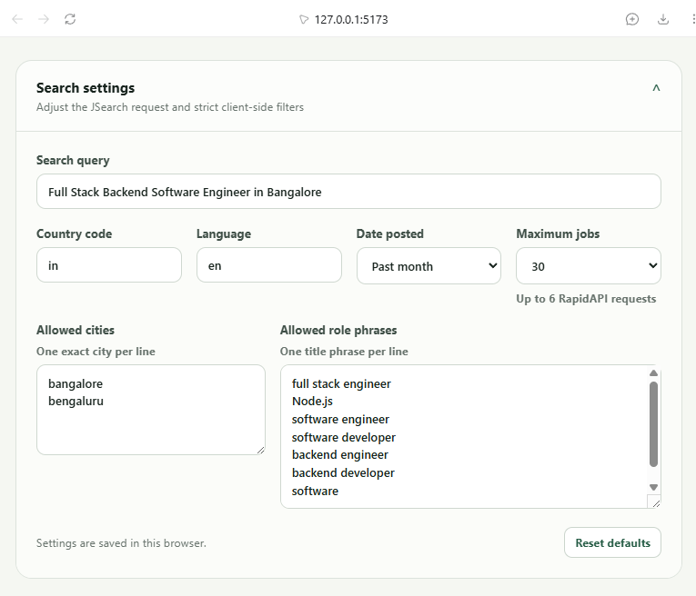
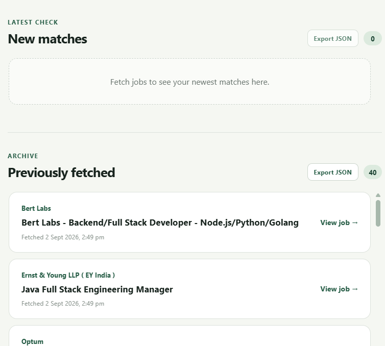

# JobScout

A lightweight FastAPI service that calls JSearch only when you request
`GET /fetch-jobs`. It has no scheduler, polling loop, or background worker.
It uses the v5-recommended `search-v2` endpoint through RapidAPI.

Configuration is separated by responsibility:

- `constants.py` contains fixed JSearch request and filtering values;
- `config.py` loads environment-driven and runtime configuration;
- `main.py` contains the FastAPI endpoint and application logic.

The React dashboard shows newly fetched jobs separately from the persistent
history stored in `job_history.json`.

## UI demo

### JobScout dashboard



### Configurable search filters



### Latest and previously fetched jobs



Every retained job is timestamped. When the API starts, it runs one cleanup
pass that removes entries fetched more than 30 days ago from both
`applied_or_seen_jobs.txt` and `job_history.json`. The seen-jobs file is created
automatically if it does not exist. Both runtime data files are ignored by Git.
This is startup maintenance, not a repeating background loop.

The search is aimed at Bangalore/Bengaluru backend and full-stack software
roles that fit a resume centered on Node.js, TypeScript, React, REST APIs,
databases, microservices, cloud, Docker, and CI/CD. The API then strictly keeps
only:

- jobs whose `job_city` is exactly `Bangalore` or `Bengaluru` (case-insensitive);
- jobs posted no more than 30 days ago;
- titles matching the configured software, backend, or full-stack role phrases;
- jobs not already stored in `applied_or_seen_jobs.txt`.

## Requirements

- Python 3.10 or newer
- Node.js 22 or newer and pnpm
- A RapidAPI account subscribed to the JSearch API

## Install

From this directory, create and activate a virtual environment.

### Windows PowerShell

```powershell
python -m venv .venv
.\.venv\Scripts\Activate.ps1
python -m pip install -r requirements.txt
```

### macOS or Linux

```bash
python3 -m venv .venv
source .venv/bin/activate
python -m pip install -r requirements.txt
```

## Configure the RapidAPI key

Subscribe to JSearch in RapidAPI, copy your key, and put it in the local `.env`
file. `.env` is ignored by Git; `.env.example` is the safe template that can be
committed.

```dotenv
RAPIDAPI_KEY=your-rapidapi-key
```

An already exported `RAPIDAPI_KEY` environment variable takes precedence over
the `.env` value.

### Windows PowerShell

```powershell
$env:RAPIDAPI_KEY = "your-rapidapi-key"
```

### macOS or Linux

```bash
export RAPIDAPI_KEY="your-rapidapi-key"
```

Environment variables set this way apply to the current terminal session.

## Run the API

```bash
uvicorn main:app --host 127.0.0.1 --port 8000
```

Use the default single worker because deduplication is stored in one local text
file and coordinated within one application process.

Open either:

- `http://127.0.0.1:8000/fetch-jobs` to fetch new matching jobs on demand;
- `http://127.0.0.1:8000/docs` for the interactive API documentation.

## Run the React dashboard

Install the frontend dependencies once:

```powershell
cd frontend
pnpm install
```

Keep the API running in the first terminal. In a second terminal, run:

```powershell
cd D:\Projects\job-alert-system\frontend
pnpm dev
```

Open `http://127.0.0.1:5173`. Use **Fetch new jobs** to start one on-demand
search. Depending on the selected limit, JobScout may follow multiple JSearch
pagination cursors. The newest unseen matches appear at the top, and all
earlier matches remain available under **Previously fetched**. Both lists are
independently scrollable and can be exported as JSON.

Open **Search settings** in the dashboard to configure the query, two-letter
country and language codes, JSearch date range, exact allowed cities, and title
phrases. You can also choose a 5, 10, 20, 30, 50, 75, or 100-job raw-result cap.
The original resume-focused values and a 100-job cap remain the defaults, and
custom settings are saved in browser storage.

Example response:

```json
[
  {
    "job_id": "example-job-id",
    "employer_name": "Example Company",
    "job_title": "Senior Backend Software Engineer",
    "job_apply_link": "https://example.com/apply",
    "fetched_at": "2026-09-02T08:30:00Z"
  }
]
```

An empty list means there are no new matches. A job is written to
`applied_or_seen_jobs.txt` only after it passes every filter, so it will not be
returned by later requests. To intentionally allow a job to appear again,
remove only that job ID from the file while the server is stopped.

## Notes

- The callable JSearch endpoint is `https://jsearch.p.rapidapi.com/search-v2`;
  `https://rapidapi.com` is the marketplace website.
- One request to `/fetch-jobs` follows JSearch v5 cursors only for that request,
  stopping when the selected raw-job cap is reached, JSearch has no next cursor,
  or twenty API pages have been requested. A 100-job fetch therefore consumes
  up to twenty RapidAPI requests before local filters and deduplication are
  applied.
- The request sets `country=in` and `language=en` for India-specific results.
- Keep `applied_or_seen_jobs.txt` on persistent local storage if you deploy the
  service and want deduplication to survive restarts.
- Each deduplication row uses `job_id<TAB>fetched_at`, with the timestamp stored
  in UTC ISO 8601 format.
